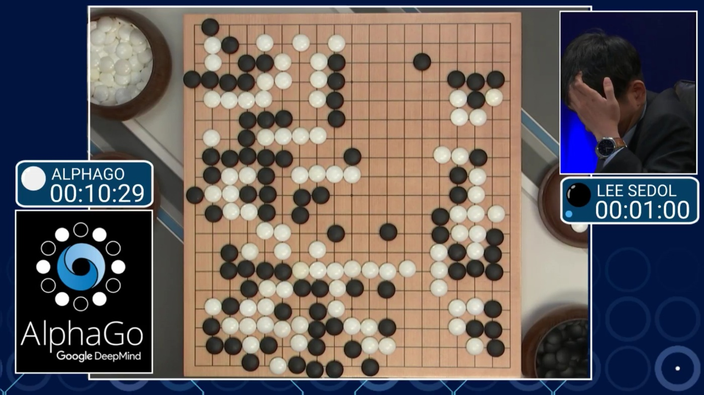
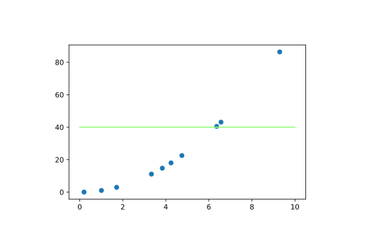
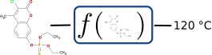

# Introduction to Machine Learning

---

# What is AI ? and ML ?

## Artificial Intelligence

- **AI**: The field of study that tries to make computers "smart"

- **ML**: A subset of AI that uses statistical methods to enable computers to learn from data

- **Deep Learning**: A subset of ML that uses neural networks with many layers


---

# A Brief History of AI

<style>
img[alt~="center"] {
  display: block;
  margin: 0 auto;
}
</style>


---
# Darthmouth Conference 

> _"We propose that a 2-month, 10-man study of artificial intelligence be carried out during the summer of 1956 at Dartmouth College in Hanover, New Hampshire. The study is to proceed on the basis of the conjecture that every aspect of learning or any other feature of intelligence can in principle be so precisely described that a machine can be made to simulate it. An attempt will be made to find how to make machines use language, form abstractions and concepts, solve kinds of problems now reserved for humans, and improve themselves. We think that a significant advance can be made in one or more of these problems if a carefully selected group of scientists work on it together for a summer."_ 

---

# How AI evolved through time ?

## Theory : The imitation game


---

## Expert systems


```prolog
person(homer).
person(marge).
person(bart).

parent(homer,bart).
parent(marge,bart).

grand_parent(X,Y) :- parent(X,Z), parent(Z,Y).
```

---

## Statistical learning, learning by example


---

## Representation Learning


[Tensorflow playground](https://playground.tensorflow.org/)

---

# AI Examples and Applications


---

# Go



---

# Medical Imaging 


---

# Autonomous Driving


---

# Recommandation Systems 


---

# Spam Detection


---

# Object Detection


---

# Generative Models


---

# NLP Generation


---

# And Chemical Science

## Molecular Property Prediction


---

## Molecular Discovery


---
## And even Nobel prizes !


---

# General Problem

## What we are talking about?


- Learning through examples
- Mimic human tasks (AI?)
- Produce outputs given some inputs (functions?)

---

## Supervised Learning
 **Purpose**  
Given a dataset $\{  (x_i, y_i) \in \mathcal{X} \times \mathcal{Y}, i = 1, \dots, N \}$, learn the dependencies between $\mathcal{X}$ and $\mathcal{Y}$.

- Example: Learn the relationship between cardiac risk and food habits. $\x_i$ is a person described by $d$ features about their food habits; $y_i$ is a binary category (risky, not risky).
- **$y_i$ is essential for the learning process.**
- Methods: K-Nearest Neighbors, SVM, Decision Tree, etc.

---

## How to Encode Data

The Matrix data : $X \in \mathbb{R}^{n \times p}$

### Samples
- $n$ samples (number of rows)
- $X(i,:) = x_i^\top$ : the i-th sample
- $x_i \in \mathbb{R}^{p}$

### Features
- $p$ features (number of columns)
- Each sample is described by $p$ features
- $X(:,j)$ : the j-th feature for all samples

$$X(i,j) : \text{j-th feature of the i-th sample.}$$

---


---

## Learning Model
### Model
$$
f : \mathcal{X} \to \mathcal{Y}
$$
$$
x_i \to \hat{y}
$$

We want that:
$$
f(x_i) \simeq y_i
$$

---

## Example


What is the underlying $f$ function?

---


---

## How to find a good $f$?
$$
f^\star = \arg \min_f \mathcal{L}(f(X), y) + \lambda \Omega(f)
$$

- $\mathcal{L} : \mathcal{Y} \times \mathcal{Y} \to \mathbb{R}$
- $\lambda \in \mathbb{R}^+$
- $\Omega : (X \to Y) \to \mathbb{R}^+$

---

## Fit to Data Term
$$
\mathcal{L}(f(X), y)
$$

- Ensures the model fits the data
- Penalizes when the predicted value $f(x_i)$ is far from $y_i$

---

## Regularization Term
$$
\Omega(f)
$$

- Constrains the complexity of function $f$
- Occam's razor: simpler is better
- $\lambda$: Weights the balance between the two terms

---


- Very high $\mathcal{L}(f(X), y)$
- Very low $\Omega(f)$

---


- High $\mathcal{L}(f(X), y)$
- Low $\Omega(f)$

---


- $\mathcal{L}(f(X), y)=0$
- High $\Omega(f)$

---


- $\mathcal{L}(f(X), y)=0$
- Very high $\Omega(f)$

---

## Generalization
*Good models generalize well*

- Good generalization: good prediction on unseen data
- Hard to evaluate without bias
- Overfitting
- Regularization term prevents overfitting

---

# Regression and Classification

## Binary Classification
- $\mathcal{Y} = \{0,1\}$
- Dog or cat? Positive or Negative?
- Performance: Accuracy, recall, precision, etc.


---

## Regression
- $\mathcal{Y} = \mathbb{R}$
- Stock market, house price, boiling points of molecules, etc.
- Performance: RMSE, MSE, MAE, etc.



---

## And Many Others
- Ranking
- MultiClass classification
- Multi Labeling
- etc.

---

# Methods
## Machine Learning Methods for Classification

- K-nearest neighbors
- Random forests
- SVM & consorts
- Multi-Layer Perceptron

---

# A first approach KNN

---

# k Nearest Neighbors
Determine properties from similar data


---

# k Nearest Neighbors
Determine properties from similar data


---
# k Nearest Neighbors
Determine properties from similar data


---
# k Nearest Neighbors
Determine properties from similar data

 

---

## K-NN Hyperparameters
### Number of Neighbors $k$
- Low number: high variability, high accuracy
- High number: smoother

### Distance
- Similarity depends on data, structure, task
- Euclidean, Manhattan, ad hoc distances

---

## KNN: The (Simple) Code!

```python
from sklearn.neighbors import KNeighborsClassifier
k = 5
metric = 'euclidean'
knn = KNeighborsClassifier(n_neighbors=k, metric=metric)
knn.fit(X, y)  # Training
y_pred = knn.predict(X)  # Prediction
```
-  [Metrics](https://scikit-learn.org/stable/modules/generated/sklearn.metrics.pairwise.distance_metrics.html)

- [Documentation](https://scikit-learn.org/stable/modules/generated/sklearn.neighbors.KNeighborsClassifier.html#sklearn.neighbors.KNeighborsClassifier)
