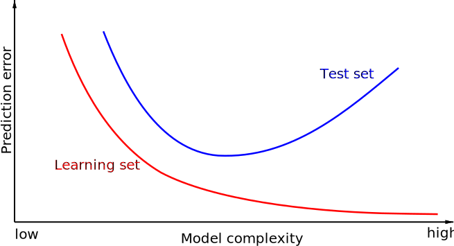
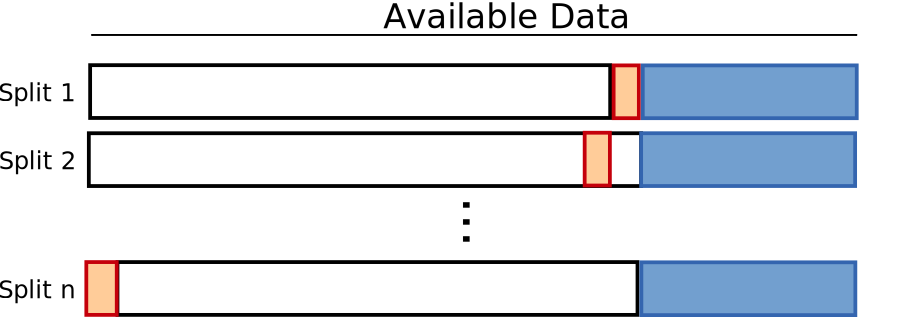
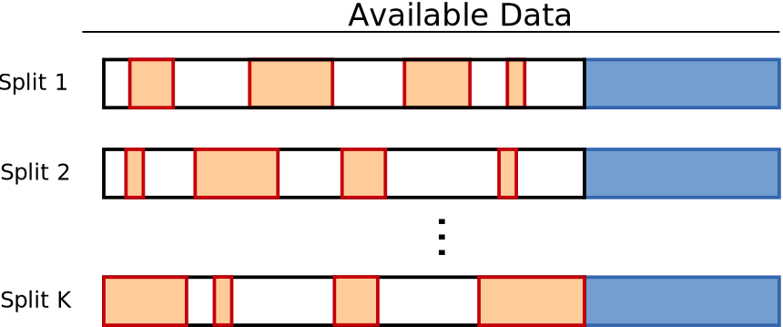

# Cross Validation

---

# Introduction

## How to learn a "good" model?

- We want good performance
- As simple as possible
- Able to predict unseen data

---

# Empirical Risk

## Error on Learning Set

- **Empirical Risk**:  
  $$ R_{emp}(f) = \frac{1}{N} \sum_{i=1}^N \mathcal{L}(f(\mathbf{x}_i), y_i) $$
- $\mathcal{L}$ evaluates the performance of prediction $\mathbf{x}_i$

- Error is computed on the training set
- The model can be too specialized on this particular dataset

---

# Generalization

## Tentative Definition

- Ability of the model to predict well on unseen data
- Hard to evaluate
- Real objective of a model

## Regularization

- Regularization term controls the model
- Balances between empirical risk and generalization ability
- Need to tune the balance ($\lambda$)

---

# How to Evaluate Generalization Ability?

## Evaluate on Unseen Data

- Define and isolate a test set
- Evaluate on the test set

## Bias

- Avoid using the same data for training and testing
- Test set must be totally **isolated**

---

# Overfitting vs Underfitting

- **Overfitting**: Low $R_{emp}$, high generalization error
- **Underfitting**: High $R_{emp}$, medium generalization error

---

# Hyperparameters

## Parameters Outside the Model

- Some parameters are not learned by the model
- They are **hyperparameters** and must be tuned
- ⚠️ Tuned on data outside the test set
- Example: $\lambda$ in Ridge Regression, $k$ in KNN.

---

# How to Tune the Hyperparameters?

## Validation Set

- Split training set into validation and learning set
- Learn model parameters using the learning set
- Evaluate performance on the validation set
- Validation set simulates the test set (unseen data)

---

# General Framework

---

# Validation Strategies

## How to Split Validation/Training Set?

- Need a strategy to split between training and validation sets
- Training set is used to tune model parameters
- Validation set is used to evaluate model performance based on hyperparameters

---

# Train/Validation/Test Split

## Single Split

➕ Only one model to learn
➖ May be subject to split bias
➖ Only one evaluation of performance

---

# Leave-One-Out

## N Splits

➖ N models to learn
➖ Validation error is evaluated on one data point

---

# KFold Cross Validation

## K Splits

➕ K models to learn
Validation error is evaluated on \(N/K\) data points
Some splits may be biased

---

# Shuffle Split Cross Validation

## K Splits

 Training/validation sets are randomly split
 ➕ K models to learn
 ➕ Avoids bias
 ➖ Some data may not be evaluated

---

# Using Scikit-Learn

- `sklearn.model_selection.train_test_split`
- `sklearn.model_selection.KFold`
- `sklearn.model_selection.ShuffleSplit`
- `sklearn.model_selection.GridSearchCV`

---

# Recommendations

## Size of Splits

- How many splits?
- How many elements per split?
- Depends on the number of data points
- Tradeoff between learning and generalization

## Stratified Splits

- Splitting may induce imbalanced datasets
- Ensure the distribution of $y$ is consistent across all sets

---

# Conclusion

- A good protocol avoids bias
- Test set is **never** used during parameter tuning
- No perfect protocol exists
