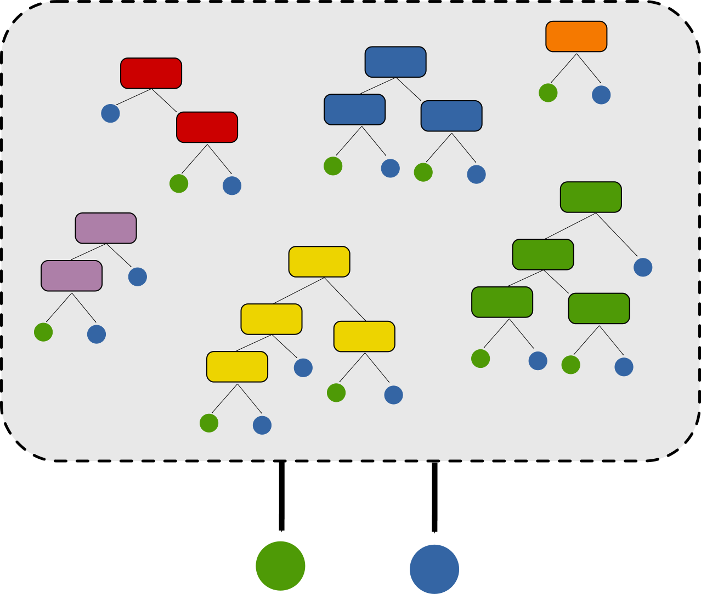
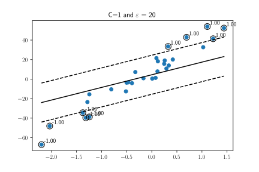

# Operating Machine Learning


---

# Introduction

## How to learn a "good" model?

- We want good performance
- As simple as possible
- Able to predict unseen data

---

# Empirical Risk

## Error on Learning Set

- **Empirical Risk**:  
  $$ R_{emp}(f) = \frac{1}{N} \sum_{i=1}^N \mathcal{L}(f(\mathbf{x}_i), y_i) $$
- $\mathcal{L}$ evaluates the performance of prediction $\mathbf{x}_i$

- Error is computed on the training set
- The model can be too specialized on this particular dataset

---

# Generalization

## Tentative Definition

- Ability of the model to predict well on unseen data
- Hard to evaluate
- Real objective of a model

## Regularization

- Regularization term controls the model
- Balances between empirical risk and generalization ability
- Need to tune the balance ($\lambda$)

---

# How to Evaluate Generalization Ability?

## Evaluate on Unseen Data

- Define and isolate a test set
- Evaluate on the test set

## Bias

- Avoid using the same data for training and testing
- Test set must be totally **isolated**

---

# Overfitting vs Underfitting

- **Overfitting**: Low $R_{emp}$, high generalization error
- **Underfitting**: High $R_{emp}$, medium generalization error

<style>
img[alt~="center"] {
  display: block;
  margin: 0 auto;
}
</style>


---

# Hyperparameters

## Parameters Outside the Model

- Some parameters are not learned by the model
- They are **hyperparameters** and must be tuned
- ⚠️ Tuned on data outside the test set
- Example: $\lambda$ in Ridge Regression, $k$ in KNN.

---

# How to Tune the Hyperparameters?

## Validation Set

- Split training set into validation and learning set
- Learn model parameters using the learning set
- Evaluate performance on the validation set
- Validation set simulates the test set (unseen data)

---

# General Framework


---

# Validation Strategies

## How to Split Validation/Training Set?

- Need a strategy to split between training and validation sets
- Training set is used to tune model parameters
- Validation set is used to evaluate model performance based on hyperparameters

---

# Train/Validation/Test Split

## Single Split

➕ Only one model to learn
➖ May be subject to split bias
➖ Only one evaluation of performance


---

# Leave-One-Out

## N Splits

➖ N models to learn
➖ Validation error is evaluated on one data point


---

# KFold Cross Validation

## K Splits

➕ K models to learn
Validation error is evaluated on \(N/K\) data points
Some splits may be biased


---

# Shuffle Split Cross Validation

## K Splits

 Training/validation sets are randomly split
 ➕ K models to learn
 ➕ Avoids bias
 ➖ Some data may not be evaluated


---

# Using Scikit-Learn

- `sklearn.model_selection.train_test_split`
- `sklearn.model_selection.KFold`
- `sklearn.model_selection.ShuffleSplit`
- `sklearn.model_selection.GridSearchCV`

---

# Recommendations

## Size of Splits

- How many splits?
- How many elements per split?
- Depends on the number of data points
- Tradeoff between learning and generalization

## Stratified Splits

- Splitting may induce imbalanced datasets
- Ensure the distribution of $y$ is consistent across all sets

---

# Conclusion

- A good protocol avoids bias
- Test set is **never** used during parameter tuning
- No perfect protocol exists

---

# ML Methods

Most useful non-deep ML models

---

# Decision Tree


**Principle**

 Learn decision rules to separate the data.

- Supervised learning for classification and regression.
- Simple to understand and interpret.
- Recursive algorithm to construct the decision trees


---

# Decision Tree


---

# Decision Tree


---

# Decision Tree


---

## Hyperparameters of Decision Tree

*  Maximum depth

Specify the maximal depth of the tree. A higher depth will make dedicated categories, but prone to overfit.

* Min number of splits

Same action as previous one.

$\to$ Both are used to terminate the recursive operation

---

## Building a decision tree - the code

```python
from sklearn.tree import DecisionTreeClassifier
max_depth = 10
criterion = 'gini'
clf = DecisionTreeClassifier(max_depth=max_depth, criterion=criterion)
clf = clf.fit(X, y)
ypred = clf.predict(X)
```

- User guide for hyperparameters: [link](https://scikit-learn.org/stable/modules/tree.html#tips-on-practical-use)
- the [documentation](https://scikit-learn.org/stable/modules/generated/sklearn.tree.DecisionTreeClassifier.html#sklearn.tree.DecisionTreeClassifier)

---

## Limitations

- Simple yet effective algorithm
- Prone to overfitting
  $\to$ one leaf $\Leftrightarrow$ one sample


---

# Ensemble Methods

## Idea

United we stand


## How to combine models ?

- Majority voting, Bagging, and Boosting

---

# Random Forests

## Principle

- Combine many decision trees to learn complex functions
- Ensemble methods, majority voting
- Bagging [(Breiman, 1996)](https://doi.org/10.1007/BF00058655)



---

## Algorithm summarization

1. Randomly choose $n$ examples (bootstrap)
2. Build a decision tree from the bootstrap
   - Randomly select $d$ features
   - Split according to best pair feature/threshold
3. Repeat $k$ times
4. Aggregate decision by majority vote or average probability

---

## Random Forests Hyperparameters

- **Number of trees** : Adjust the number of trees composing the forests
  - low number: fast to compute, but less accurate
  - high number: slower to compute, but more accurate up to some number
- **Number of features** : 
Determine the number of features to be used when splitting the data
  - See the guidelines of `scikit-learn`

- **Tree depth** : Specify the maximal depth of tree. A higher depth will make dedicated categories, but less generalizable.

---

# Random Forests: the code

```python
from sklearn.ensemble import RandomForestClassifier
n_estimators = 20 # the number of trees in the forest
max_depth = None # expand as you can
max_features = "sqrt" # RTFM
clf = RandomForestClassifier(n_estimators=n_estimators, max_depth=max_depth, max_features=max_features)
clf.fit(X,y)
ypred = clf.predict(X)
```

- User guide for hyperparameters: [link](https://scikit-learn.org/stable/modules/ensemble.html#forest)
- the [documentation](https://scikit-learn.org/stable/modules/generated/sklearn.ensemble.RandomForestClassifier.html#sklearn.ensemble.RandomForestClassifier)


---


# SVM & consorts

---
# Support Vector Machines


Principle Find the best line which separates the data


---
# Support Vector Machines


Principle Find the best line which separates the data


---
# Support Vector Machines


Principle Find the best line which separates the data


* Best separation $\Rightarrow$ points far away the separation
*  support vectors 

---


# Support Vector Machines
What happens when there is no separation line?


---
# Support Vector Machines
What happens when there is no separation line?


- $\Rightarrow$ We allow errors!

---


# Support Vector Machines

Hyperparameter $C$ controls the trade off between errors and separation
<table>
  <tr>
    <td></td>
    <td></td>
  </tr>
  </table>

  --- 

# Support Vector Machines
  <table>
  <tr>
    <td></td>
    <td></td>
  </tr>
</table>


---

## Extension to non linear separation

Thanks to kernel trick, SVM can compute any kind of separation line


-   Depends on kernel


---
## SVM Hyperparameters


* **C** : Adjust the importance of errors
  -   low C : fast to compute, more simple separation, more errors
  -   high number : slower to compute, less errors, maybe too complex separation line

- **kernel** : Determine how the separation line is build
  - linear : straight line
  - poly, rbf, sigmoid : complex lines, basic choice is rbf
  - precomputed : provide a similarity matrix (more difficult)

---

## $C$ and $\varepsilon$ impact

<div class="slide" style="text-align: center;">
  
  
  
  
</div>

---
## SVM : the code !

```python
python from sklearn import svm
C = 1
kernel = 'rbf'
clf = svm.SVC(C=C,kernel=kernel)
clf.fit(X,y)
ypred = clf.predict(X)
```

-   User guide for hyperparameters : [link](https://scikit-learn.org/stable/modules/svm.html#tips-on-practical-use)

-   the [documentation](https://scikit-learn.org/stable/modules/svm.html#classification)

---

# Conclusion

- **Understand key concepts**: cross-validation, unseen data evaluation.
- Use **proper validation strategies**: train/validation/test splits, leave-one-out, KFold, shuffle split.
- **Learn model specifics**: decision trees, random forests, SVMs, their principles, hyperparameters, and scikit-learn usage.
- **Avoid bias**: ensure proper validation and hyperparameter tuning for better performance and generalization.

