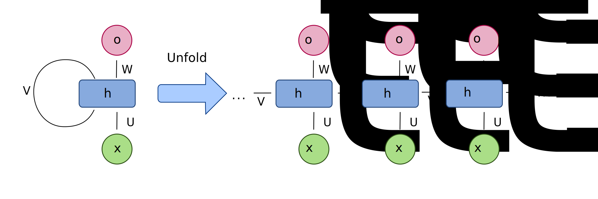
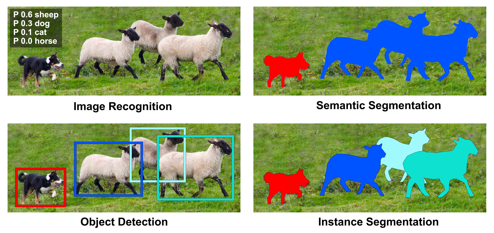

<style>
img[alt~="center"] {
  display: block;
  margin: 0 auto;
}
</style>


# Introduction to Representation Learning

---
# Limitations of Other Methods

## Classic ML

1. Choose a dataset and a task
2. Compute features from the data
3. Learn the model on features
4. Predict


---

## Problems

**How can we be sure that our features are optimal?**

- They define the latent space.
- Model ability to learn is limited by these representations.
- Hard to know what we miss

---

# Neural Networks and Deep Learning

## Motivation

- End-to-end learning.
- Let the model find the optimal representation for the task.


---

# Historical of Neural Networks

## History of NN

---

## How to Simulate Human Intelligence?

### The Human Brain

- Able to learn and adapt.
- Simple neurons connected together.
- Good connections are boosted during learning.
- Bad connections are weakened.

---

## Brain Neuron


---

## McCulloch Pitts (MCP) Neuron in 1943


- A first simple approach.

---

## The Perceptron Learning Rule


- The learning rule.
- Basics of NN.

---

# And Then...

## Progression:


- Adaline
- Multilayer Perceptron
- LeNet
- AlexNet


---

# The Perceptron Model

## Artificial Neurons

- Inputs $x$: vector components.
- Weights $w$: how inputs are used/combined.
- Output $z = w^\top x + b$: net input.
- Neuron fires if $z > 0$, i.e.,

$$
\sigma(z) = 
\begin{cases} 
1 & \text{if } z > 0 \\ 
0 & \text{otherwise} 
\end{cases}
$$

---

## Perceptron Learning Rule

1. Initialize weights to small random values.
2. For each training sample $x_i$:
   1. Compute the output value $\hat{y}$.
   2. Update the weights.
   3. Repeat until convergence.

---

## How to Update

- Update weights according to the error:
  $$
  w_j = w_j + \Delta w_j
  $$
- $\Delta w_j$ is the update for weight $j$:
  $$
  \Delta w_j = \eta (y_i - \hat{y}_i) x_i(j)
  $$
- it depends on the error $(y_i - \hat{y}_i)$
- $\eta$ is the learning rate.
- Same principle to update bias: $b = b + \Delta b$, where $\Delta b = \eta (y_i - \hat{y}_i)$.

-> [Notebook](./Notebooks/Perceptron.ipynb)

---


---

## Adding Some Complexity

### Linearity

- The model is linear by design => limited by construction.
- Add non-linearities:
  $$
  z = g(w^\top x + b)
  $$
  where $g$ is a differentiable function (ReLU, tanh, sigmoid, ...).

### Layers

- Add more layers to increase complexity of interactions in $x$.
- Leads to Multi-Layer Perceptrons (MLPs) and **Deep Learning**.

---

# The Multi-Layer Perceptron (MLP)
## Principle

- Learn the best representation of data.
- Weights $w$ are optimized by gradient descent.
- Sequence of layers.


---

## MLP Hyperparameters

### Hidden Layers

- **Number of layers**: more layers lead to deeper networks.
- **Number of neurons per layer**: more neurons make networks wider.
- Increased number of neurons make models more complex.
 
### Activation Function

- Determines non-linearity in the model:
  - Identity: linear model.
  - Tanh, ReLU, logistic: non-linear. ReLU is popular.

---

## MLP: The Code!

```python
from sklearn.neural_network import MLPClassifier

activation = 'relu'  # default
layers = [32, 64, 128, 64, 32]  # 5 layers with varying sizes
clf = MLPClassifier(hidden_layer_sizes=layers, max_iter=500)
clf.fit(X, y)
ypred = clf.predict(X)
```

--- 

# TensorFlow Playground

[Essayons !](https://playground.tensorflow.org/)


--- 
 
# Application to MNIST 

-> [Notebook](./Notebooks/MLP_MNIST.ipynb)

```python
import matplotlib.pyplot as plt
from sklearn.datasets import load_digits
from sklearn.neural_network import MLPClassifier
from sklearn.model_selection import train_test_split

X, y = load_digits(return_X_y=True)
plt.imshow(X[124, :].reshape(8, 8), cmap="gray")

X_train, X_test, y_train, y_test = train_test_split(X, y)
mlp = MLPClassifier(hidden_layer_sizes=(64, 32, 16),
                    activation='relu', verbose=True)
mlp.fit(X_train, y_train)

from sklearn.metrics import accuracy_score
print(accuracy_score(y_test, mlp.predict(X_test)))  # 0.977...
```

--- 

# Extensions of MLP

How to learn on non tabular data ? 

## Constraints 
 - Data must be of fixes size dimensions
 - Continuous
 - All parts must be differentiable

## Nature of the data

- How to take into account data topology/geometry ? 
- Is MLP sufficient ? 

---

# Learning Representations

Learn good representations according to the data for better predictions.

---

# RNN : Adaptation to sequences



- LSTM
- GRU

---

# Convolutional Neural Networks

MLP are designed for tabular data, not for images


-  No translation invariance
-  No spatial invariance


Images have structure, and we want to exploit it

  


--- 

# CNNs


## Convolutional Layers

Centered on a pixel, apply a (learnt) filter  


## Pooling Layers

Reduce the size of the image, keep the most important information

---


--- 

# Benefits of CNNs

-  Translation invariance
-  Spatial invariance
-  Fewer parameters
-  Hierarchical features

[Let's see](https://github.com/aharley/nn_vis)

---

# Tasks in Computer Vision

Considering images, we can have different tasks :

-  Image Classification
-  Object Detection
-  Semantic Segmentation
-  ...

Everything is how to define the problem

---

# Image Classification


Given an image, predict what is in it

$$
\text{Image} \rightarrow \mathbb{N}
$$


exemple : ImageNet, CIFAR-10, MNIST

---

# Object Detection

Given an image, predict what is in it, and where

$$(\text{Image} \rightarrow \mathbb{N}) \times (\text{Image} \rightarrow \mathbb{R}^4)$$


example : YOLO, COCO, VOC

---

# Semantic Segmentation

Given an image, predict for each pixel, what is the class

$$ \text{Image} \rightarrow \mathbb{N}^{\text{width} \times \text{height}}$$


---

# Instance Segmentation

Given an image, predict for each pixel, what is the class, and to which instance it belongs

$$ \text{Image} \rightarrow \mathbb{N}^{\text{width} \times \text{height}} \times \mathbb{N}^{\text{width} \times \text{height}}$$



---
# Image Generation

Given a text, generate an image

$$ \rightarrow \text{Image}$$

example : DALL-E, midjourney, 


---

# Applications of Neural Networks in Computer Vision

-  Medical Imaging
-  Autonomous Vehicles
-  Robotics
-  ...


Different tasks, different architectures

---


# First Conclusion

Neural Networks are a powerful tool for Computer Vision

They can be used for a wide range of tasks

Next question : how to train them?

---

# How deep learning models learn ?

---

## A deep learning model

A deep learning model is a function that maps an input to an output

$$ f : \mathcal{X} \to \mathcal{Y}$$

**Example** 
-  The input is an image
-  The output is a pixel class prediction
-  The model is parametrized by weights


---

## Learning Process

- Deep Learning models learn by **minimizing a loss function**
- The loss function measures how well the model is performing
- Weights are updated to minimize the loss function
- $$ \mathbb{R}^{width \times height} \to \mathbb{R}$$


---

## Learning iteration

- **Feed Forward** : Compute the output of the network
- **Backpropagation** : Calculate the gradients
- **Optimizer** : Update the weights


---

## Feed Forward

- **Feed Forward**  is the process of computing the output of the network


---


## Backpropagation

- **Backpropagation** is the process of calculating gradients
- According to the loss function


---

## Optimizer

$$w_{k+1} \leftarrow w_k - \alpha_k \frac{\partial L(y,\hat{y})}{\partial w_k}$$

#### Key Terms:
- $w_k$: Current weights
- $\alpha_k$: Learning rate
- $\frac{\partial L(y,\hat{y})}{\partial w_k}$ : Gradient of the cost function


### Dynamics of Learning:
- **Step Direction** : Show how the weights are updated iteratively.
- **Learning Rate Impact** : Too high → Oscillation; Too low → Slow convergence.


---


---

## Key Concepts

1. **Epochs**: Number of complete passes through the training dataset
2. **Batch Size** : Number of samples processed before updating the model
3. **Learning Rate** : Controls how much to change the model in response to the estimated error


---

## Summary

- Deep learning requires a **model**   and (lot of) **data**  
- Deep Learning relies on a combination of **loss functions**  , **optimizers**  , **backpropagation**  , and key parameters to learn effectively.

--- 

# Deep Learning 

Steps to learn a model

1. Define the problem
4. Define the model
3. Collect the data
5. Train the model
6. Evaluate the model

... and repeat



---

# Define the problem

## What are we trying to solve ?


The problem can generally be defined by specifying the input and the output

---

# Collect the data

## What data do we have? Need of labels ?

A machine learning model needs data to learn

Finding (good) data will define the success of the model

---

# Preprocess the data

-  Images are not always in the right format
-  Some data augmentation can be useful
-  Normalization
-  Some data may be dirty (garbage in, garbage out)

---

# Define the model

## What architecture to use?

Depending on the specific task, some architectures may be more suited than others

Structure ? Reccurence ? Time Series ? Natural Language ?

---

# Code the model

-  Define the architecture using a library
-  Loss function : depending on the task
-  Optimizer : SGD, Adam, ...
-  Learning loop : classic code [see below](#learning-iteration)

Generally these steps rely on a library (PyTorch, TensorFlow, ...)

--- 

# Train the model

-  Feed the data to the model
-  Compute the loss
-  Backpropagate the gradients
-  Update the weights
-  Repeat

This step may take a long time depending on the ressources, architecture, and data

---

# Good Practices

## Train/valid/test split

We are interested in the generalization of the model: test it on unseen data to assess its performance. Tune hyperparameters on the validation set.


---

# Good Practices

## Always test a simple baseline

To asses the performance of a model, we need to compare it to a simple baseline. Even random guessing can be a good baseline.

## Learn on representative data

Modern IA is only as good as the data it was trained on. Make sure the data is representative of the task.

--- 


# Good Practices

## Check learning curves

Training loss must decrease. 

Validation loss must decrease, then increase.

Best model is the one with the lowest validation loss.

[[figure taken from F. Chollet] ](https://www.manning.com/books/deep-learning-with-python)

--- 


# Let's code

We will use PyTorch to train a simple CNN on MNIST


```python
import torch
import torchvision
import torch.nn as nn
import torch.optim as optim
import torch.nn.functional as F

train_loader = torch.utils.data.DataLoader(torchvision.datasets.MNIST('data', train=True, download=True,   transform=torchvision.transforms.ToTensor()), batch_size=32, shuffle=True)

class Net(nn.Module):
    def __init__(self):
        super(Net, self).__init__()
        self.conv1 = nn.Conv2d(1, 32, 3, 1)
        self.conv2 = nn.Conv2d(32, 64, 3, 1)
        self.dropout1 = nn.Dropout(0.25)
        self.dropout2 = nn.Dropout(0.5)
        self.fc1 = nn.Linear(9216, 128)
        self.fc2 = nn.Linear(128, 10)

    def forward(self, x):
        x = F.relu(self.conv1(x))
        x = F.relu(self.conv2(x))
        x = F.max_pool2d(x, 2)
        x = self.dropout1(x)
        x = torch.flatten(x, 1)
        x = F.relu(self.fc1(x))
        x = self.dropout2(x)
        x = self.fc2(x)
        return x

model = Net()

# Define the loss and the optimizer
criterion = nn.CrossEntropyLoss()
optimizer = optim.Adam(model.parameters(), lr=0.001)
# Train the model
nb_batch_to_print = 100
for epoch in range(10):  # loop over the dataset multiple times
    running_loss = 0.0
    for i, data in enumerate(train_loader, 0):
        inputs, labels = data
        optimizer.zero_grad()
        outputs = model(inputs)
        loss = criterion(outputs, labels)
        loss.backward()
        optimizer.step()
        running_loss += loss.item()
        if i % nb_batch_to_print == nb_batch_to_print-1:    
            print('[%d, %5d] loss: %.3f' %
                    (epoch + 1, i + 1, running_loss / nb_batch_to_print))
            running_loss = 0.0

print('Finished Training')
```

---

#  And other things

## Transformers
 - SOTA for NLP and Images
 - GPT is for Generative Pretrained Transformer
 - Embed the context to deduce a better decision

## Generative Models
- GAN
- Diffusion Models
- ...

---

# Conclusion

- Neural Networks are powerful ML methods
- Big family of architectures
- Paradigm shift : representation is learnt, not only the decision boundary
- Strong results since 12 years

## Next : Adapt NN to (molecular) graphs

---

# References 

- Francois Chollet. **Deep learning with Python**. Simon and Schuster, 2021.
- Aurélien Géron. **Hands-on machine learning with Scikit-Learn**, Keras, and TensorFlow. O’Reilly Media, Inc., 2022.
- Sebastian Raschka, Yuxi Hayden Liu, Vahid Mirjalili, and Dmytro Dzhulgakov. **Machine Learning with PyTorch and Scikit-Learn: Develop machine learning and deep learning models with Python**. Packt Publishing Ltd, 2022.