
<!-- 
slides_becquerel_6_decembre
talk_school_chemistry_2022
slides_GNN 
slides_PBS
-->

# Graph ML in Chemistry

---

# Why Graphs?

Graphs are a general modelisation tool to encode entities with relations/interactions

---

---

---

# Graph theory

## Graph Definition

A graph $G$ is a pair $(V, E)$ where $V$ is a set of vertices and $E$ is a set of edges

In case of **labeled graphs** we associate two functions:
 - $l_v : V \rightarrow L_v$ for the vertices
 - $l_e : E \rightarrow L_e$ for the edges

---

# Differences with vectors

- Graphs generalize vectors
- Relationships between components
- No predefined order

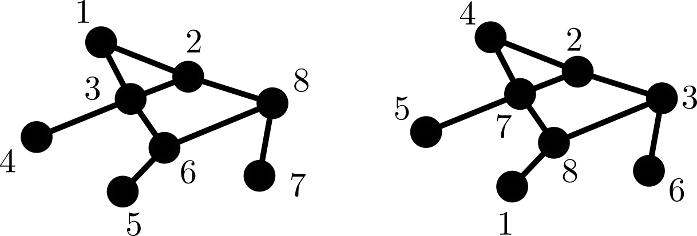

---

## Neighbours and Adjacency

- Two nodes are said to be adjacent if they are connected by an edge: $u \sim v \Leftrightarrow (u,v) \in E$. 
- The set of neighbours of a node $u$ is denoted $\mathcal{N}(u)$ and is defined as $\mathcal{N}(u) = \{v \in V | (u,v) \in E\}$
- The degree of a node $u$ is the number of neighbours of $u$ and is denoted $d(u) = | \mathcal{N}(u)|$

---

# Graphs in Chemistry

- Molecules can be represented as graphs
- Nodes are atoms
- Edges are bonds

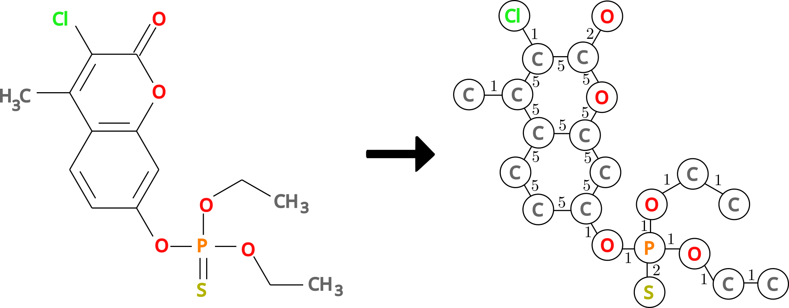

---

## Molecular property prediction

- Given a molecule represented as a graph, predict its boiling point
- Useful for virtual screening in drug discovery

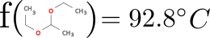

---

## Drug discovery

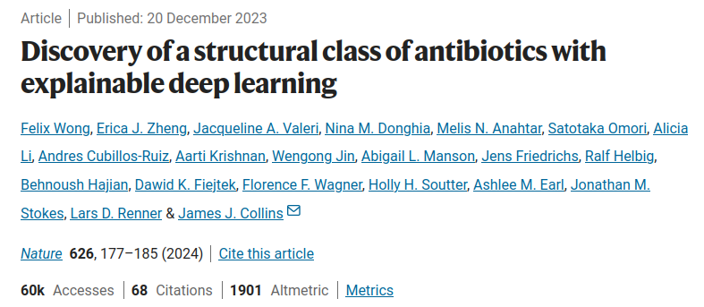

---

## Protein folding

- AlphaFold by DeepMind
- Predict the 3D structure of a protein given its amino acid sequence
- 2024 Nobel prize in Chemistry

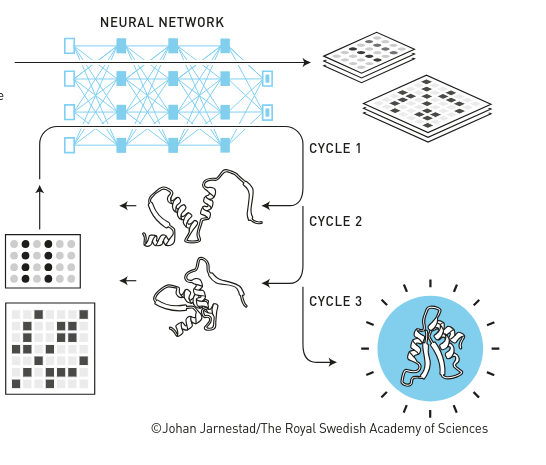

---

# Problems with ML on Graphs

**Graph space is not an Euclidean space**

## Variable number of nodes
- No fixed/limit number of nodes
- How to deal with a variable number of nodes/neighbours ?

## Permutation (equi/in)variance
- No predefined order of nodes
- $\Rightarrow$ No order on neighbours ($\neq$ images)

---

# Permutation Invariance

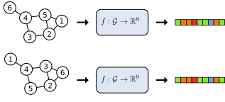

---

# Permutation Equivariance

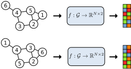

---

# Graphs versus Images

## Images
- Constant number of neighbours
- Fixed position of neighbours
- We want shift invariance

## Graphs
- Variable number of neighbours
- No predefined ordering of neighbours
- Permutation (equi/in)variance

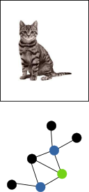

---

# **How to connect graphs with Machine Learning ?**

---

# Classic Methods 

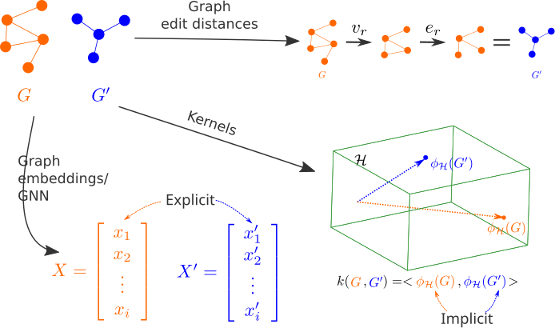

---

# Representation Learning on Graphs

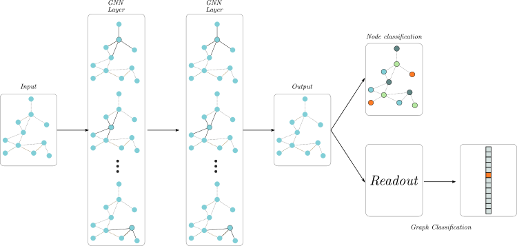

---

# GED

Define a distance between graphs

- Quantify the distortion to transform one graph into another

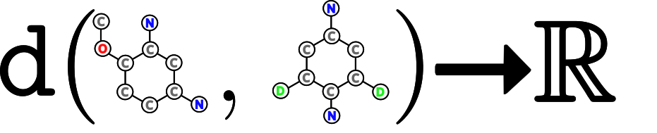

---

## Graph Edit Distance
- Based on elementary edit operations: addition, deletion, substitution of nodes or edges
- $ged(G_1,G_2) = 0 \Leftrightarrow G_1 = G_2$

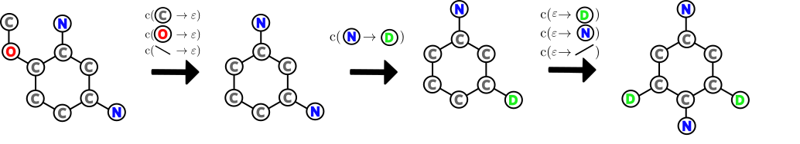

---

## Graph Edit Distance

- Edit path $\gamma$ : sequence of elementary edit operations

- Each edit operation $e$ has a cost $c(e)$ 
- Cost of an edit path $\gamma$ is $c(\gamma) = \sum_{e \in \gamma} c(e)$
- $ged(G_1,G_2) = \min_{\gamma} c(\gamma)$

---

## Graph Edit Distance

- We have a distance between molecules !
- We can use distance based ML like KNN
- Take care of the complexity

---

# Graph Embeddings

$$f : \mathcal{G} \to \mathbb{R}^d$$

- Associate a vector to the whole graph
- Permutation invriant function

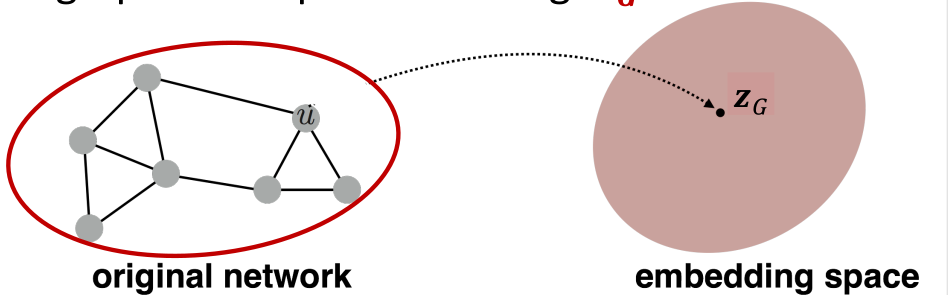

---

# Simple Approach

Reach the invariance by an invariant aggregation function (sum, mean, etc)

$$\mathbf{g} = \sum_{v \in V} \mathbf{v} $$

Graph representation is a resume of the set of node representations.

Depends on the quality of node embeddings

---

# Fingerprints

Use a set of **predefined** molecular substructures
- Widely used in Chemoinformatics
- Simple to comput, can be used in any ML model
- RDkit, OpenBabel
- [MACCS keys](https://github.com/rdkit/rdkit/blob/master/rdkit/Chem/MACCSkeys.py)
- [PubChem fingerprints](https://ftp.ncbi.nlm.nih.gov/pubchem/specifications/pubchem_fingerprints.pdf)
- ECFP, Morgan fingerprints, etc

---

# Graph Kernels

All seen embeddings approaches require to define explicitly the vector. 

- Limits the expressivity
- The bigger the size, the more complex the computations

**Idea**:

Uses a mathematical trick to combine graph similarity measure with SVM

- Compute a similarity measure between graphs
- Use SVM with this similarity measure with kernel="precomputed"

---

# Kernel Trick Example

## Example

- No linear solution.
- $\mathbf{x} \in \mathbb{R}^2, \mathbf{x} = \{x_1, x_2\}$
- $\phi : \mathbb{R}^2 \to \mathbb{R}^3$
- $\phi(\mathbf{x}) = \{x_1, x_2, x_1^2 + x_2^2\}$
- Solution in $\mathbb{R}^3$

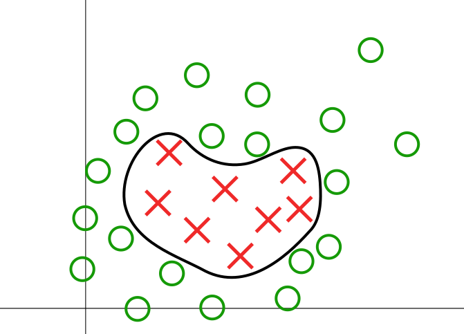

---

# Kernel Definition

**Graph kernel based on bags of patterns**

1. **Extraction** of a set of patterns
2. **Comparison** between **patterns**
3. **Comparison** between **bags** of patterns

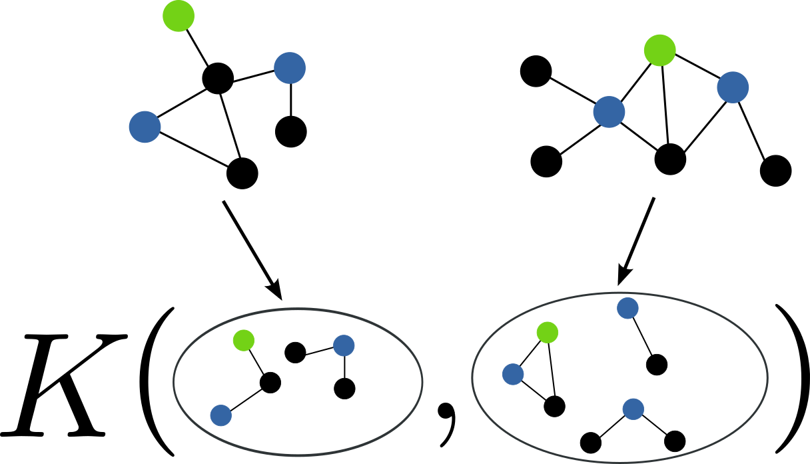

---

# Kernel Definition

**Counting function**

$f_t(G)$: Number of occurrences of treelet $t$ in $G$

**Kernel definition**

$$k_{\mathcal{T}}(G, G') = \sum_{t \in \mathcal{T}(G) \cap \mathcal{T}(G')} k_t(G, G')$$

- $\mathcal{T}(G)$: Set of patterns extracted from $G$
- $k_t(G, G') = k(f_t(G), f_t(G'))$
- $k_t(., .)$ : Similarity according to $t$

**Graph similarity** $\Rightarrow$ **Similarity of their bags of patterns**

---

# Graph Kernels for Chemoinformatics

- Treelet Kernel
- Shortest Path Kernel
- Graphlet Kernel
- Weisfeiler-Lehman Kernel
- ...

All implemented in libraries like GraKel and graphkit-learn

---

# GNNs

Translate the CNN to Graphs

---

# Convolution on Graphs : Message Passing Neural Networks

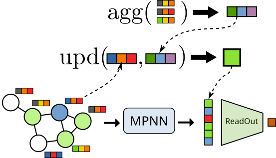

---

# Pooling on Graphs

Two kind of poolings :
- Reduce the graph to a single vector (Readout)
- Reduce the graph to a smaller graph

**Rationale**:

Graph pooling methods help reduce the graph size while preserving essential information for downstream tasks.

---

# Readout Functions

[How Powerful are Graph Neural Networks ?](https://arxiv.org/abs/1810.00826)

- Analyse the expressiveness of statistical permutation invariant functions

- Global Pooling (Readout)

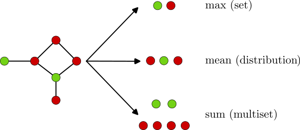

---

# Graph Pooling
## Select, Reduce, Connect (SRC)
[Reference](https://arxiv.org/abs/2110.05292)

SRC is a framework for pooling methods based on three operations 
 1- Select: Choose important nodes
 2- Reduce: Aggregate nodes
 3- Connect: Define edges to preserve graph structure

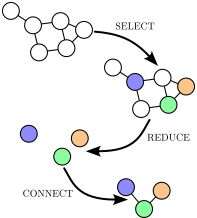

---

# Cluster Based Approaches

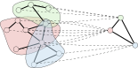

---

# DiffPool
[DiffPool Paper](https://arxiv.org/abs/1806.08804)

DiffPool clusters nodes based on learned assignments, resulting in a pooled graph representation.

- Differentiable node assignment matrix
- Enables end-to-end training for hierarchical graph representations

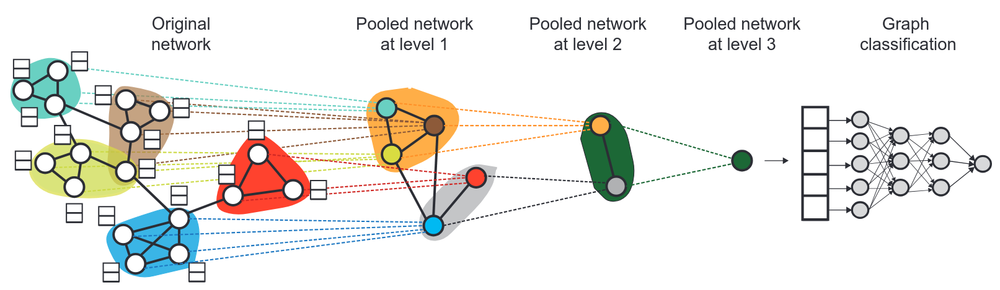

---

# Node Drop Approach

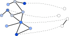

---

# TopKPool 
[TopKPool](https://arxiv.org/abs/1905.05178) selects the top-k most important nodes based on learnt scores.

- Adaptive selection of nodes per layer
- Provides flexibility and robustness in pooling

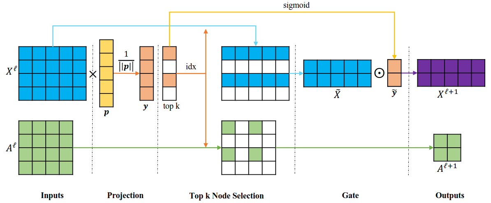

---

# Graph Generation

Instead of predicting a property, generate a graph

- The output of the model is a graph
- Ongoing research with COBRA
- Useful for drug discovery, molecular design, etc

- [A lof of contributions !](https://github.com/AspirinCode/papers-for-molecular-design-using-DL)

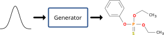

---

# Datasets

From LCMT lab : 

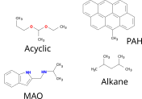

---

# Internet datasets

- [TUDataset](https://chrsmrrs.github.io/datasets/) (available in Pytorch Geometric)
- [MoleculeNet](https://moleculenet.org/)
- [Open Graph Benchmark](https://ogb.stanford.edu/)

---
# My personnal experience

cf PDF.

---
# Conclusion

- Graphs are a powerful tool to represent molecules
- Many methods to deal with graphs
- Graph Neural Networks are the state of the art
- Many applications in Chemistry

Image from <a href="https://www.nature.com/articles/s43246-022-00315-6">[Graph neural networks for materials science and chemistry]</a>
